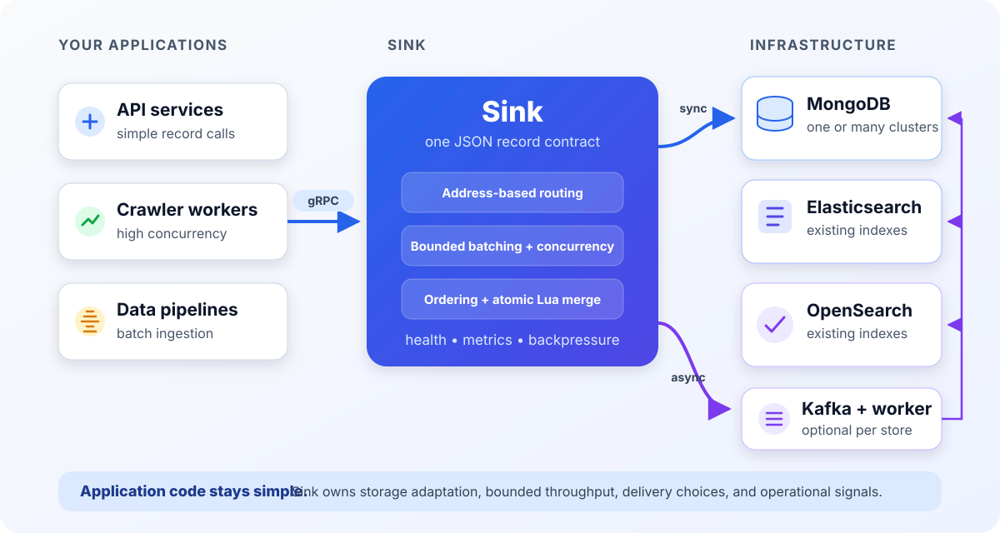
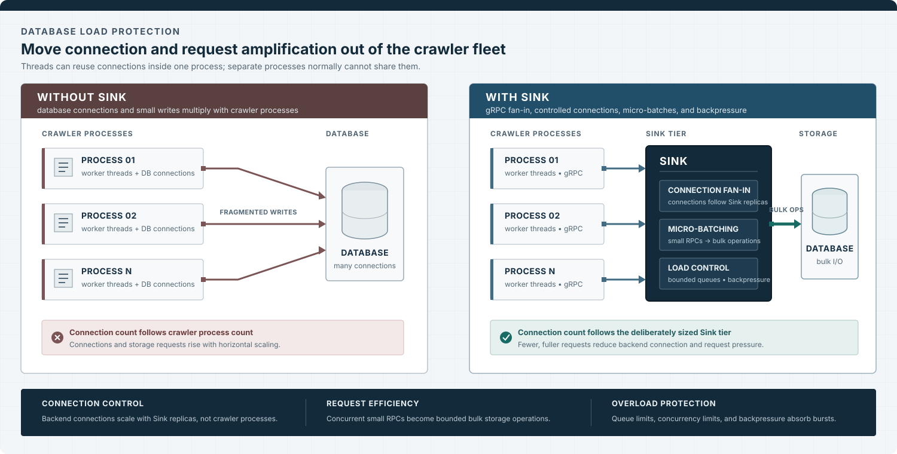

# Architecture and behavior

This document describes the behavior behind Sink's small public API. Start with
the [main README](../README.md) for the problem Sink solves and a local
quickstart. Deployment settings and their validation rules live in the
[configuration reference](configuration.md).

## Request path

Applications send JSON record operations over gRPC. Each operation carries a
logical address, and Sink routes it to the configured store with the matching
name. The selected adapter converts the storage-independent record into native
MongoDB, Elasticsearch, or OpenSearch work.

The public service exposes three methods:

- `Read` reads one or more records.
- `Write` performs complete-document puts or Lua-driven merges.
- `Delete` permanently deletes one or more records.

All three methods are batch-native. A one-operation request is the single-record
form. Results remain in request order and include their operation index, even
when Sink executes independent work concurrently.

The default maximum encoded gRPC request and response size is 64 MiB. Operation
counts and transport sizes are configurable independently.

## Connection fan-in and storage protection

Threads in one crawler process can reuse database connections, but separate
processes and pods normally cannot share them. In a direct-write topology,
adding crawler processes therefore adds potential database connections. Small,
independent writes also multiply network round trips and storage-side request
scheduling.

Sink moves the database client boundary into a separately sized service tier.
Crawler processes keep gRPC connections to Sink, while each Sink process owns
the backend clients and their database connections. The synchronous batcher
then coalesces concurrent small RPCs for the same store into bounded storage
batches. MongoDB can use collection-level bulk operations, and Elasticsearch or
OpenSearch can use `_mget` and `_bulk`. Queue limits, adapter concurrency limits,
and backpressure stop caller concurrency from passing through to a backend
without bounds.

This changes the scaling relationship: database connection count follows the
number of Sink replicas instead of the number of crawler processes. It is not a
global connection cap. Every Sink replica has process-local clients,
connections, queues, and batchers, so replica count and backend capacity must
still be sized deliberately. Batching also stays within one Sink process and one
store; callers that already have several records should send an explicit batch
when possible.

## Address routing

A record address contains `store`, `namespace`, `dataset`, and `key`. Sink does
not use a separate binding layer: the client-provided `store` must exactly match
a case-sensitive `storages[].name` in the server configuration.

| Address field | MongoDB | Elasticsearch and OpenSearch |
| --- | --- | --- |
| `store` | Configured storage name | Configured storage name |
| `namespace` | Database name | Logical business namespace |
| `dataset` | Collection name | Complete existing index or alias name |
| `key` | MongoDB `_id` | Document `_id` |

One request may target several stores. Sink routes their operations
independently, executes unrelated store groups concurrently, and restores the
original result order. An unknown store produces a failure for only the
affected operation.

## Documents and storage adapters

The public protocol carries JSON objects. Storage-specific conversion remains
inside each adapter. Typed date-time values stay RFC3339 strings in JSON and
carry JSON Pointer metadata so adapters with a native date-time type can
preserve it without guessing from the string value.

### MongoDB

The MongoDB adapter maps a record address directly to database, collection, and
`_id`. It preserves the top-level document shape and lazily adds one configurable
metadata field for Sink's internal revision. The field is removed from reads.

Batch reads use one `$in` query per collection. Unconditional puts and creates
use unordered bulk writes. Revision-conditional writes execute concurrently as
individual operations so each result can be correlated with its precondition.
Legacy documents without Sink metadata receive it through a conditional first
mutation, keeping their first read-modify-write atomic.

### Elasticsearch and OpenSearch

The search adapter stores the JSON document unchanged in `_source`. It uses
`_mget` for reads, `_bulk` for puts and hard deletes, and `_seq_no` plus
`_primary_term` as an opaque revision token. Several configured endpoints are
used for transport failover.

Sink does not create or manage indexes, mappings, or aliases. The address's
`dataset` must name a complete existing index or alias.

## Ordering, concurrency, and batching

Atomicity is per record, never per request. Operations for the same address run
in request order. Operations for different records or stores may run
concurrently.

In `server` and `all` modes, Sink automatically coalesces concurrent
one-operation RPCs into bounded, process-local batches for each store. Reads
always use this path when batching is enabled. Synchronous writes and deletes
use it as well; Kafka-backed mutations bypass it because the publisher already
batches asynchronous work.

Read, write, and delete queues are independent for each store. This keeps a
slow method or backend from consuming another queue's allowance. Each queue is
bounded by operation and byte limits. A request that would exceed a limit fails
with `RESOURCE_EXHAUSTED` before it is applied.

The collection window is intentionally short. Dispatch occurs when the window
expires or when accepting another request would cross a configured operation or
byte target. Explicit client batches remain more efficient when work is already
available because they avoid per-RPC transport overhead. Aggregation never
crosses stores or Sink processes.

See [Synchronous request batching](configuration.md#synchronous-request-batching)
for every queue and batching setting.

## Mutation completion

`Write` and `Delete` support three completion modes:

- `WAIT_UNTIL_APPLIED` returns after the storage adapter acknowledges the work.
- `WAIT_UNTIL_VISIBLE` also waits until a following search read can observe it.
  Elasticsearch and OpenSearch use `refresh=wait_for`; acknowledged MongoDB
  writes are already visible.
- `RETURN_AFTER_ACCEPTED` returns after the selected store's Kafka publisher
  durably accepts the mutation.

A store without Kafka remains fully usable for synchronous operations. An
asynchronous operation targeting it receives a retryable `UNAVAILABLE` failure
without failing unrelated operations in the same request.

## Lua read-modify-write

A merge carries a Lua program and incoming JSON. Sink reads the current record,
runs the program, and writes the result with the adapter's revision
precondition. On a revision conflict, Sink reads the latest record and retries
up to the configured limit. Each attempt is atomic without exposing a
database-specific compare-and-swap API to applications.

Programs travel with the request so business rules can be versioned with client
code. A batch declares identical source once by SHA-256 digest. Sink caches the
compiled program but creates a fresh VM for each execution, isolating mutable
global state. Asynchronous queue records contain the full source and remain
replayable without server-side rule registration.

Lua runs inside a restricted environment with time, instruction, source, and
result limits. See [Lua merge programs](configuration.md#lua-merge-programs)
for its signature, JSON bridge, available libraries, and resource limits.

## Asynchronous delivery

Kafka is configured per store. Different stores may use different clusters,
topics, consumer groups, retry policies, and dead-letter topics. The publisher
uses a deterministic encoded record address as the Kafka key, keeping mutations
for one record in a single partition and in submission order.

Kafka is disabled by default. For an enabled store, startup reconciles the
source and dead-letter Topics before creating its publisher or worker. Sink can
create missing Topics, increase partition counts, reassign replicas, and set
retention according to the Store configuration. It refuses to reduce a
partition count because doing so requires destructive Topic recreation.

Workers disable auto-commit and apply queued mutations through the same service
path as synchronous writes. Retryable failures use bounded exponential backoff
with jitter. Malformed records, permanent failures, and exhausted retries are
copied to the configured dead-letter topic before their source offsets are
committed.

Delivery is at least once. If a worker crashes after storage applies a mutation
but before Kafka commits its offset, Kafka can redeliver and execute the
mutation again. Applications must make retryable mutation intent safe for that
possibility.

## Health and observability

Startup is strict: Sink opens and pings every configured store before becoming
ready. It reconciles Topics for every Kafka-enabled store in all modes. In
`server` and `all` modes, it also creates and pings a publisher for each enabled
store. Configuration, Topic-policy, or dependency errors fail startup instead
of producing a partially initialized service. A standalone `worker` has no
gRPC readiness endpoint; Kafka consumer connection errors are handled and
reported by its polling loop.

At runtime in `server` and `all` modes, the standard gRPC health service reports
process readiness. Each storage and configured Kafka publisher also has its own
health service name. A failed dependency becomes `NOT_SERVING` without marking
unrelated stores unavailable.

The optional Prometheus listener exports build, gRPC, operation, batching,
merge, publisher, and worker metrics. Labels intentionally exclude store names,
namespaces, datasets, keys, and error text to keep cardinality bounded. See
[Prometheus metrics](configuration.md#prometheus-metrics) for the metric list
and network exposure guidance.

## Reliability boundaries

- Multi-record requests are not transactions.
- Async delivery can execute a mutation more than once.
- Sink does not automatically make an arbitrary complete-document write
  idempotent.
- Storage schema, indexes, mappings, aliases, backup, and replication remain
  responsibilities of the backing systems.
- Batching and queues are local to one Sink process; replicas do not share
  in-memory state.
- Startup requires every configured dependency. Runtime dependency failures
  are isolated where possible and reported separately.

These boundaries keep the record contract portable without hiding guarantees
that only a specific database or deployment can provide.
