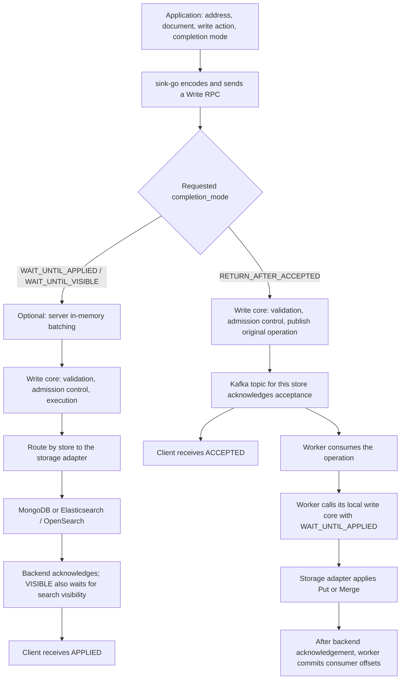

# One document from submission to storage: the Sink write flow

This guide describes the **local source as of 2026-09-07**: Sink `48a3ebc`
and the Go SDK `a658b05`. It explains code behavior; configuration defaults
are not a statement about the settings currently deployed in production.

The main path is straightforward: **the client gives Sink a write operation.
Sink uses its address to select one storage backend, then uses the completion
mode for that call to either write directly or publish to Kafka for a worker
to apply later.** Lua Merge is one way to modify a document; request batching
is an execution optimization along the way.

## 1. The complete path



The diagram shows successful execution. Section 7 covers failures.

There are two different kinds of queue:

- **Server in-memory batching queue:** briefly collects requests to reduce
  backend calls. The client continues waiting for the execution result.
- **Kafka queue:** durably accepts write intent. The client can return before
  a worker completes the database write.

An operation's `store` selects one backend. Writing to MongoDB does not
implicitly replicate the document to Elasticsearch. To write to both,
submit separate operations targeting the two stores.

## 2. Follow one ordinary synchronous Upsert

Assume the server has a MongoDB store named `primary`, and the application
wants to write product `product-42`. Think of the request as:

```text
Address:
  store     = primary
  namespace = catalog
  dataset   = products
  key       = the string product-42

Document: { "name": "Example product", "price": 99 }, encoded as BSON
Write action: Upsert (replace the whole document, or create it if absent)
Completion mode: WAIT_UNTIL_APPLIED
```

**Step 1: The application calls the SDK.**

A `Dataset` binds `Store`, `Namespace`, `Dataset`, and `Encoding`. Each
`Record` supplies a `Key` and `Value`. The application passes the completion
mode when calling `Dataset.Upsert`. Creating this SDK object only binds
parameters; it does not create a database, collection, or search index.

The SDK serializes the Go value as BSON and wraps it in a `WriteOperation`.
One document becomes one entry in `operations`, using the same batch-native
`Write` RPC as a multi-document request. Larger calls are split into RPCs
according to the SDK's operation-count limit, with result indexes mapped
back to the original input order.

**Step 2: The request reaches the Sink server.**

The service checks that the request is nonempty and that its operation count
and completion mode are valid. If `service.batching.enabled` is enabled
(the default) and the request targets one configured store, this synchronous
request enters that store's in-memory Write queue. It may execute together
with other RPCs sharing namespace, dataset, and completion mode. Explicit
multi-dataset RPCs execute alone. The default collection window is 2 ms; operation-count and
byte limits can trigger earlier dispatch. **The 2 ms window is a collection
window, not an end-to-end latency limit.** Queueing and backend execution
also take time.

With batching disabled, the request enters the write core directly. RPCs
that span multiple stores also enter the core directly, where the storage
router dispatches their operations to the appropriate backends.

**Step 3: The write core parses operations and checks execution capacity.**

The core validates addresses, document encodings and payloads, and write
actions. It also limits in-flight requests, execution bytes, and concurrent
requests per store. Direct requests with insufficient capacity receive
`RESOURCE_EXHAUSTED`; dispatched micro-batches wait within their deadlines.
Coalesced RPCs retain separate read/output budgets, and execution groups split
at RPC boundaries when their combined reservations exceed the byte limit.

In this example, Upsert means "write this complete document without requiring
that the record already exist or be absent." It does not execute Lua or
perform the read-and-compute sequence used by Merge.

**Step 4: The storage router selects the MongoDB adapter.**

The address maps as follows:

| Request field | Meaning in this example |
| --- | --- |
| `store = primary` | Select the backend and connection configured with `storages[].name = primary` |
| `namespace = catalog` | MongoDB database `catalog` |
| `dataset = products` | MongoDB collection `products` |
| `key = product-42` | MongoDB `_id`, using the string `product-42` |

The adapter validates the BSON document and uses the address key as `_id`.
If the document already includes `_id`, it must match the address. The
adapter adds Sink's internal revision metadata and writes to MongoDB.
The metadata field defaults to `__sink` and is removed from documents
returned through Sink reads.

Multiple ordinary Upsert/Create operations for the same collection can use
one bulk write. Each operation retains its own result; the batch is not a
transaction.

**Step 5: After backend acknowledgement, the result returns to the caller.**

The adapter returns the operation's status and revision, and the core builds
its `WriteResult`. If multiple RPCs were combined earlier, the batching
layer returns each original RPC once all of its operations have final results,
without waiting for unrelated document chains. Success
in this example returns `APPLIED`: MongoDB has acknowledged the write.

The SDK's `Dataset.Upsert` aggregates individual operation failures into a
`BatchError`. When using the lower-level `Client.Write` directly, also inspect
the results, for example with `WriteResultsError(results)`. An RPC-level
`err == nil` alone does not mean every operation succeeded.

## 3. The two choices that determine the flow

Every write makes two independent choices: **how to modify the document**
and **how far execution must progress before returning success**.

### Choice one: how to modify the document

| SDK method | Existing document requirement | Behavior |
| --- | --- | --- |
| `Dataset.Create` | Must be absent | Write a complete document; fail the precondition if it already exists |
| `Dataset.Replace` | Must exist | Replace it with the complete new document; fail the precondition if absent |
| `Dataset.Upsert` | May exist or be absent | Replace the whole document if present, or create it if absent |
| `Dataset.Merge` | Read the document at execution time | Run Lua to compute the final document, then write it with a revision condition |

The first three methods are all `Put` operations in the protocol.
**Upsert does not preserve old fields omitted from the incoming document.**
For example, if the old document contains `name` and `price`, an Upsert that
only supplies `price` does not automatically retain `name`. Use Merge and
explicit Lua rules when fields must be preserved or combined according to
business logic.

Merge also requires a missing-document policy: fail with
`MissingDocumentFail`, or allow Lua to create a document from an absent
state with `MissingDocumentCreate`.

### Choice two: when to return success

| Completion mode | Uses Kafka | Success status | What has been confirmed when the call returns |
| --- | --- | --- | --- |
| `WAIT_UNTIL_APPLIED` | No | `APPLIED` | The backend acknowledged the write |
| `WAIT_UNTIL_VISIBLE` | No | `APPLIED` | The backend acknowledged the write and met its visibility requirements |
| `RETURN_AFTER_ACCEPTED` | Yes | `ACCEPTED` | Kafka acknowledged acceptance; the database write may not have started |

The completion mode belongs to a `Write` request and applies to all its
operations. The zero value, `UNSPECIFIED`, is rejected. Enabling Kafka for
a store makes asynchronous delivery available; it does not automatically
make every write asynchronous.

For MongoDB, `WAIT_UNTIL_VISIBLE` uses the same write path without an
additional search refresh step. For Elasticsearch/OpenSearch, it adds
`refresh=wait_for` to `_bulk` and waits for search visibility. This does not
force a refresh on every call or change the index's refresh interval.
Sink's key-based `Read` uses `_mget` on search backends. Successfully reading
a document by key does not establish that `_search` can already find it.

Search stores require **JSON**, with `dataset` naming the complete existing
index or alias. MongoDB stores require **BSON**. Sink does not automatically
convert between these encodings or create search indexes and mappings.
The SDK applies Go `bson` tags for BSON encoding and `json` tags for JSON
encoding.

## 4. Asynchronous writes: who actually writes to storage, and when

Changing the example's completion mode to `RETURN_AFTER_ACCEPTED` changes
the path to:

1. The server bypasses synchronous in-memory batching, parses and validates
   the operation, and enters the publication path.
2. The publisher uses `store` to select a Kafka topic and encodes the
   **original operation** as a message. A Put message carries the complete
   document. A Merge message carries the incoming document, missing-document
   policy, and full Lua source.
3. The publisher waits for Kafka acknowledgement. The current implementation
   requires acknowledgement from all in-sync replicas (ISR). On success,
   the client receives `ACCEPTED`, and that RPC ends.
4. A worker consumes messages from the store's topic, verifies that they
   belong to its store, and organizes them into execution batches.
5. The worker calls **`Server.Write` in its own process**, using
   `WAIT_UNTIL_APPLIED`. This is an internal Go call; it does not connect
   back to the server's gRPC endpoint, republish to Kafka, or enter the
   server's synchronous in-memory batching queue.
6. The write core applies Put/Merge through the storage adapter. Only after
   backend acknowledgement does the worker commit eligible consumer offsets.

For an asynchronous Merge, the server validates and compiles Lua during
acceptance, but **reading the existing document, executing the merge, and
writing the result** happen when the worker applies it. Kafka stores merge
intent rather than a final document computed at request acceptance time.
Create/Replace existence conditions and backend encoding or mapping
constraints can therefore still fail during worker execution.

`ACCEPTED` does not later turn into `APPLIED` on the original RPC. The current
protocol also does not return an asynchronous task ID whose final status
can be queried. Verify progress using worker metrics, logs, the dead-letter
queue (DLQ), and the business data itself. Because the worker uses
`WAIT_UNTIL_APPLIED`, committed consumer offsets do not establish that a
search index has completed its refresh.

If Kafka is not enabled for the target store, an asynchronous operation
receives a retryable `UNAVAILABLE` failure; it does not fall back to a
synchronous write. Accepted messages accumulate while no worker is available,
subject to the topic's retention policy.

Deployment modes determine where the components run:

| Top-level configuration `mode` | What the process does |
| --- | --- |
| `server` | Serve gRPC, execute synchronous operations, and publish asynchronous operations for stores with Kafka enabled |
| `worker` | Consume Kafka and execute database writes locally; expose no business gRPC service |
| `all` | Run both sets of components in one process |

## 5. Merge: how the existing document becomes the new document

Consider a Merge where the stored price is 80 and the incoming price is 99:

```text
Read the existing document and revision r1
  current  = {name: "Example product", price: 80}
  incoming = {price: 99}
             |
Execute function(current, incoming) in Sink's Lua VM
  Assume the business script preserves name and uses incoming.price
  result = {name: "Example product", price: 99}
             |
Write result only if the stored revision is still r1
             |
Success: obtain revision r2 and return APPLIED
Conflict: read the latest document, rerun Lua, and retry the conditional write
```

Lua executes inside Sink or its worker, and its complete output document
is written back. It is not a MongoDB update statement or a script executed
inside Elasticsearch. If the document is absent and creation is allowed,
Lua receives `current = nil`, and the write requires that the record still
be absent.

This version check is compare-and-swap (CAS): the write succeeds only if
another writer has not changed the version since it was read. MongoDB uses
Sink's internal revision field; search backends use `_seq_no` and
`_primary_term`. On a definite revision conflict, Sink currently allows
**3 attempts by default, including the initial attempt**, controlled by
`service.max_merge_attempts`. Exhaustion produces a retryable `CONFLICT`.
A network timeout or lost acknowledgement is not a definite revision
conflict and does not establish that the previous attempt had no effect.

### Multiple writes for one document may share one commit

The synchronous path folds Puts and Merges for the same full address and
completion mode within an execution batch. For three merges:

```text
Read the existing document once
  -> Lua 1 -> in-memory result 1
  -> Lua 2 -> in-memory result 2
  -> Lua 3 -> final document
  -> Write once, using the revision condition from the original read
  -> After a successful commit, each successful operation returns APPLIED
     with the same final revision
```

Every Lua program still executes. Intermediate documents are not persisted
separately; backend validation, write events, and search visibility waits
apply to the final commit. A failed Lua operation leaves the current
in-memory document unchanged, so later Lua operations can continue from
the most recent successful state. Once the final commit succeeds, each
operation retains its own success or failure result. A revision conflict
recomputes the entire run from the latest document. If the final commit
fails, no operation in that run can report success.

A Put replaces the in-memory document at its position in the chain. Create
requires that working state to be absent; Replace requires it to be present;
Upsert always replaces it. Failed conditions leave it unchanged. A chain of
Upserts writes only its last document without reading, and a single Put keeps
its existing direct adapter path. Conditional or mixed chains read once and
commit against that snapshot. Puts and Merges share the same final revision
when their chain commits successfully.

A change of completion mode on the same address splits these runs.
Interleaved operations for other addresses do not split a run.
Folding does not span execution batches or Sink replicas, and it does not
hold a single request indefinitely while waiting for more updates.
Asynchronous publication preserves every original operation separately.
The current worker places operations for the same address into separate
execution waves, so multiple Kafka merges for one document do not enter
the folding path described above together.

If every modification needs its own database commit and events, issue
sequential calls and wait for each to complete. See the
[folding contract](merge-folding.md) for the full boundaries. Repeated Reads
fetch one backend observation per address and return independent results;
every copy still counts against the response budget. Repeated synchronous
Deletes issue one backend delete and return its outcome to all callers.

## 6. Which layer is doing the batching?

| Layer | Organizer | What it combines | Effect on the call |
| --- | --- | --- | --- |
| Explicit SDK batching | Application / sink-go | Multiple operations in one call, split into RPCs if necessary | Fewer RPCs, with individual results preserved |
| Automatic server batching | `BatchingServer` | One store in one process; mutations also share namespace, dataset, and mode | Bounded collection and execution; each Write RPC returns when its own results are final |
| Record operation folding | Service core | Puts/Merges or repeated Reads/Deletes for one full address | One final write, read, or delete with individual results preserved |
| Backend bulk operations | Storage adapter | Database operations that can be sent together | Fewer backend requests; partial success remains possible |
| Kafka publication / consumption batching | Publisher / worker | Independent messages | Batched transport, execution, and offset commits |

Synchronous batching keeps `WAIT_UNTIL_APPLIED` and `WAIT_UNTIL_VISIBLE`
separate. It does not strengthen an applied-only request into a search
refresh wait. The two modes can execute concurrently for disjoint addresses
when capacity permits. A mode change on the same address preserves batch
collection order by completing the preceding run first. Write/Delete queues
track these record dependencies across batches as well: later independent RPCs
can execute while an earlier batch waits for refresh. Execution remains bounded
by the process and per-store capacity limits.
Completed document chains release their queued successors even if the same
execution still contains other unfinished documents. Conditional/Lua failures
from speculative state are not final until the chain commits or definitively
fails. A shared backend bulk still has to return before its results are known.

Disabling `service.batching.enabled` only disables the server's automatic
batching across RPCs. Explicit batches, operation folding in the core, adapter
bulk operations, Kafka consumption batches, core admission checks, and
backend concurrency limits still apply.

Ordering guarantees have a scope. Within one request, operations for the
same full address follow input order. With stable partition routing, Kafka
consumes that address's messages in partition order. Separate server
replicas, independent Read/Write/Delete queues, mixed synchronous and
asynchronous writes, multiple producers, and DLQ replay do not share one
global business ordering guarantee. The caller must explicitly coordinate
operations that require "A before B."

## 7. Where the document stands when something fails

| Result or symptom | Meaning | What happens next |
| --- | --- | --- |
| Synchronous `APPLIED` | The backend acknowledged the write | The call is complete; search visibility still depends on the completion mode |
| Asynchronous `ACCEPTED` | Kafka accepted the operation | A worker applies it later; storage failure remains possible |
| `PRECONDITION_FAILED` | For example, Create found an existing record, Replace found none, or Merge exhausted its conflict attempts | Inspect `failure.code` and `retryable` to distinguish the cause |
| Individual `FAILED` | An operation failed validation or encountered another execution error | Inspect that operation's failure; other operations may have succeeded |
| Timeout, disconnection, or lost acknowledgement | The caller cannot determine the final outcome | An issued write may still complete; do not assume it had no effect |
| Temporary worker failure | For example, an unavailable backend or processing timeout | Keep unresolved offsets uncommitted and retry after backoff |
| Permanent worker failure | For example, an undecodable message or an unmet business precondition | Acknowledge the DLQ copy before allowing the source offset to advance |

The worker commits only the resolved contiguous prefix of each partition.
It cannot skip an unresolved temporary failure to commit later records.
Exhausting one round of retries does not send a temporary failure to the
DLQ. If DLQ publication or offset commit fails, the affected source messages
remain pending for recovery.

Kafka-to-database delivery is **at least once**. If the database write
succeeds but the worker crashes before committing the offset, the operation
may execute again. The SDK also does not automatically retry write transport
errors because the write may already have taken effect. Sink's revision
checks prevent conflicting writes from overwriting each other, but do not
recognize a second delivery of the same business operation. A Merge that
increments a quantity by one may increment it again after redelivery.
Applications must implement business idempotence, for example through
operation IDs and atomic check-and-apply rules.

## Source references

Use these entry points to keep this guide aligned with future changes:

| Flow | Implementation entry point |
| --- | --- |
| Protocol, addresses, completion modes, and result statuses | [sink.proto](../proto/sink/sink.proto) |
| SDK parameter binding, encoding, and error aggregation | [sink-go dataset.go at the reviewed revision](https://github.com/liran/sink-go/blob/a658b054cea20c71f753ce21a5754885fc254318/dataset.go) |
| SDK batch splitting and Write RPCs | [sink-go client.go at the reviewed revision](https://github.com/liran/sink-go/blob/a658b054cea20c71f753ce21a5754885fc254318/client.go) |
| Server and worker component wiring | `newApplication` in [main.go](../cmd/sink/main.go) |
| Synchronous batching and completion-mode separation | [batching_server.go](../internal/service/batching_server.go), [mutation_batches.go](../internal/service/mutation_batches.go) |
| Request dispatch, admission control, and Put/Merge execution | `Write` in [server.go](../internal/service/server.go), [admission.go](../internal/service/admission.go), [write.go](../internal/service/write.go) |
| Write folding for one document | [write_group.go](../internal/service/write_group.go), [folding contract](merge-folding.md) |
| Publishing original intent to Kafka | [publish.go](../internal/service/publish.go), [publisher.go](../internal/queue/kafka/publisher.go) |
| Consumption, retries, DLQ, and offset commits | [worker.go](../internal/queue/kafka/worker.go), [processor.go](../internal/worker/processor.go) |
| Backend writes | [MongoDB write.go](../internal/storage/mongodb/write.go), [Search write.go](../internal/storage/search/write.go) |
| Configuration and recovery details | [Configuration reference](configuration.md), [Reliability guide](reliability.md) |
